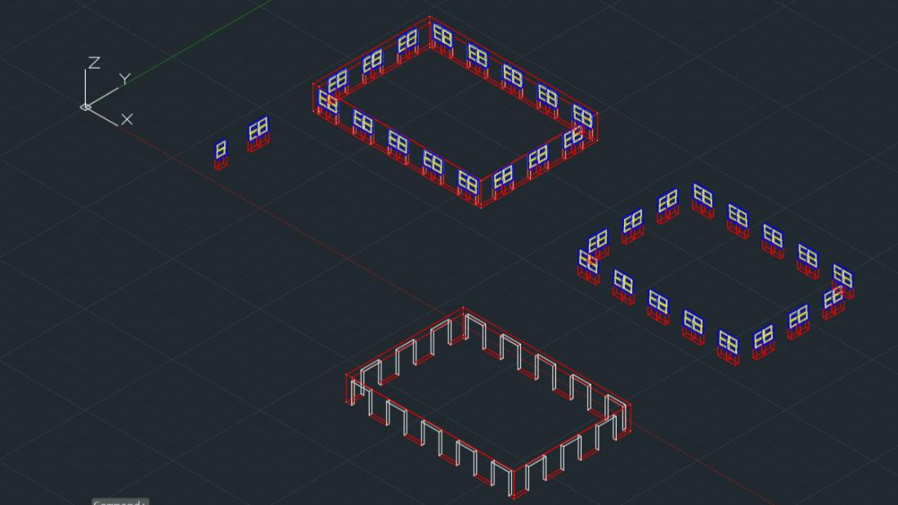

# Empire State Building Model - Computer-Aided Graphics Project

### Overview
This project is a detailed 3D model of the Empire State Building, created in Autodesk AutoCAD as part of a university course on Computer-Aided Graphics. It demonstrates proficiency in 3D modeling, technical design, and AutoCAD functionality, with a focus on architectural detail and realistic rendering.

### Table of Contents
1. [Motivation](#motivation)
2. [Historical Background](#historical-background)
3. [Project Goals and Scope](#project-goals-and-scope)
4. [Development Stages](#development-stages)
    - [Initial Prototypes](#initial-prototypes)
    - [Semi-Finished Prototype](#semi-finished-prototype)
    - [Final Model](#final-model)
5. [Technologies and Tools Used](#technologies-and-tools-used)
6. [Lessons Learned](#lessons-learned)
7. [Screenshots](#screenshots)

---

### Motivation
This project merges my technical skills with a longstanding fascination for architecture. Since childhood, I have admired iconic structures, and the Empire State Building stands out as a marvel of engineering and design. Although my career path is in computer science, this project allowed me to explore the intersection of technology and architectural beauty, a fusion that AutoCAD supports remarkably well.

  

By recreating this iconic skyscraper, I was able to challenge my skills in spatial visualization, accuracy, and detail—all crucial for any complex technical project. The process also offered an opportunity to better understand the intricacies involved in architectural design, enhancing my appreciation for both the creative and technical efforts required to bring such monumental structures to life.

### Historical Background
The Empire State Building, located at the intersection of Fifth Avenue and 34th Street in New York City, is not only a globally recognized landmark but also an engineering marvel. Completed in 1931, this building held the record as the world’s tallest structure for over 40 years.

  

Designed during the Art Deco period, its sleek lines and towering presence make it a symbol of both the era and the innovative spirit of its creators. The building’s significance extends beyond its architectural achievements; it is an icon in popular culture and a testament to the advancements in engineering of its time.

  

Recognized as one of the Seven Wonders of the Modern World by the American Society of Civil Engineers, the Empire State Building continues to inspire architects, engineers, and artists worldwide.

### Project Goals and Scope
The aim was to create a detailed 3D model of the Empire State Building at a scale of 1:304.8 in AutoCAD. The model includes walls, windows, columns, and entryways, utilizing various 3D techniques. Emphasis was placed on precision in design and realistic material rendering.

### Development Stages
Each stage of the project was documented and visualized through images to illustrate progress.

#### Initial Prototypes
In this phase, the focus was on constructing the base structure and understanding AutoCAD’s 3D tools to achieve an architectural shape similar to the Empire State Building. Various functions were employed to create the foundational layers of the model.

Functions used:
- **`extrude`**: Created basic 3D shapes from 2D outlines for walls and columns.
- **`join`**: Combined edges and surfaces to form a cohesive model base.
- **`copy`** and **`move`**: Duplicated and repositioned elements like windows and structural details.
- **`presspull`**: Used to adjust the thickness of elements for added depth.
- **`3Dmove`**: Aligned and positioned 3D shapes accurately within the model space.
- **`mirror`**: Simplified symmetry by replicating details on both sides of the building.

**Gallery**:
    
 

These images show the base structure, where I began with simple extrusions and moved elements to create the building’s basic shape. Initial layers were applied: **red for walls**, **blue for doors**, and **yellow for door frames**. This stage established the core layout of the model, focusing on the primary dimensions.

#### Semi-Finished Prototype
In this stage, I focused on adding structural and aesthetic details, including windows, doors, and exterior patterns. The aim was to enhance the model’s architectural authenticity by incorporating repetitive design elements across the building.

Functions used:
- **`box`**: Defined window placements and consistent frame sizes.
- **`array`** and **`mirror`**: Created uniform, repeated placements for windows across floors.
- **`substract`**: Carved spaces in the walls for windows and doors, creating a more realistic facade.
- **`align`** and **`scale`**: Ensured accurate alignment and proportional scaling of elements.
- **`fillet`**: Added subtle rounding to edges for a smoother architectural look.

**Gallery**:
    
 

This set of images highlights the careful placement of windows using the `array` function to replicate the windows’ positions. `Substract` was applied to create realistic spaces, which significantly improved the model's accuracy. This phase showcases the addition of window frames and placements, using `array` and `mirror` functions for precision alignment.

#### Final Model
In the final stage, real-world materials were assigned to each part for a polished look. Additionally, I added minor details and checked structural integrity to ensure a cohesive visual outcome.

Functions used:
- **`material`** and **`render`**: Applied textures for realism, such as glass, aluminum, and concrete finishes.
- **`union`**: Merged elements together, like walls and columns, for a seamless structure.
- **`3D orbit`** and **`viewbase`**: Finalized views and rendered the model for presentation from multiple angles.
- **`sweep`** and **`loft`**: Created smooth transitions between architectural sections.

**Gallery**:
    
 

These final images demonstrate the model with realistic textures applied:
- **Clear Glass** for windows.
- **Aluminum** for window frames and door handles.
- **Concrete textures** for walls, columns, and door surroundings.
The final model presents a polished, scaled-down replica of the Empire State Building, showcasing structural and material accuracy.

### Technologies and Tools Used
- **AutoCAD 2022**: Primary software for model creation and rendering.
- **File formats**: `.dwg` (saved in AutoCAD 2018 format for compatibility).
- **Key Functions**: `extrude`, `join`, `copy`, `move`, `presspull`, `3Dmove`, `mirror`, `substract`, `array`, `material`, `render`, `union`, `3D orbit`, `viewbase`, `sweep`, `loft`.

### Lessons Learned
This project provided valuable insights not only into technical 3D modeling but also into effective project management and documentation. Working through each stage of this model taught me the importance of breaking down complex tasks into manageable steps and documenting my progress thoroughly. This approach not only ensured a smoother workflow but also improved my ability to communicate project details clearly. These skills are essential for teamwork, as they allow others to understand my work and contribute more effectively to collaborative projects. I am confident that these experiences have enhanced my capability to work in team environments, where clear communication and organized documentation are key.

### Screenshots
Each stage of the project is documented through images to visualize the development process and final product.
